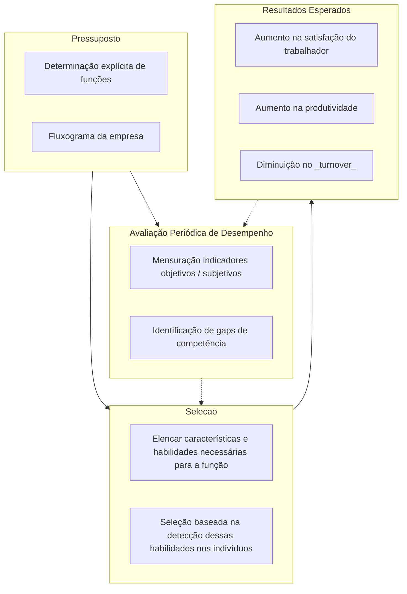

# O papel do psicólogo na organização industrial - _Wanderley Codo_

A importância da indústria na economia cresce (este texto foi publicado em 1981), paradoxalmente o desejo de atuar e as
críticas aos psicólogos que atuam neste ambiente crescem.

`(..) um misto de asco e comiseração comum a mãe (prendada) que se refere a uma filha que se prostituiu.`

O propósito da função desse profissional nas organizações seria: _combinar indivíduos com as ocupações com as quais se
habilita_ (Psicologia industrial, Tiffin e e McCormick - 1969). `manter o homem certo no lugar certo`.

## Críticas

O psicólogo se coloca a serviço da indústria: ao invés de transformar a estrutura produtiva para que venha a satisfazer
as necessidades do ser humano, transforma o ser humano à imagem e semelhança da indústria.

Domínio de uma classe sobre outra => domínio das ideias da classe dominante => a ciência é apropriada pelo dominante

No entanto, `a crítica que produz a não intervenção é uma crítica covarde`.

> É verdade que o psicólogo industrial é um empregado de patrão, contratado para fazer frente ao operário. Por isto
> mesmo, o psicólogo consciente deveria estar na indústria refletindo conscientemente para tentar subverter suas
> funções.

## A Indústria Real

Para um operário:

- engenharia industrial: divisão da atividades para aumento de produtividade
- atividade não exige seleção => trabalhador substituível
- treinamento e promoção dos operários não passa pelos psicólogos (mas pelos gestores técnicos)
- exército industrial de reserva precariza trabalho

A opressão desse trabalhador não passa pelo psicólogo industrial

Como o operário resiste à alienação intrínseca:

- reivindica sua admissão a sua perspicácia
- não perde qualquer oportunidade de aperfeiçoar-se

> (...) uma revalorização de si mesmo, ainda que seja através da fantasia.

## Conclusão

Se a crítica à Psicologia do Trabalho é que essa "tenta adaptar o homem à indústria", na verdade, a indústria tenta
eliminar o indivíduo que trabalha, pelo menos do ponto de vista psicológico. Em outras palavras: transformar o trabalho
do operário em força de trabalho como qualquer outra força: elétrica, mecânica, etc.

> Se alguma frase puder substituir o right man in the right place, sugiro em oposição qualquer coisa semelhante a
> nowhere man in any place.

Em outras palavras, se o psicólogo industrial pudesse de fato executar seu trabalho prescrito, o operário teria sua
capacidade aprimorada, fortalecendo-o.

## A atividade do Psicólogo Industrial

- selecionar e classificar de fato homens mais capacitados para exercício de suas funções, informando ao candidato os
  resultados dos testes a que fo submetido, assim como os critérios que subjazem sua aprovação ou reprovação.

- avaliação de desempenho com critérios objetivos para promoção, rebaixamento ou demissão.

- treinar os operário não apenas na sua função específica mas, também, mostrando funcionamento da estrutura toda de
  produção.

Todas essas atividades geram: aumento do poder de barganha, conscientização, segurança e dignidade.

> (...)tal atuação está longe de ser possibilitada sem riscos; os psicólogos dispostos a atuar dentro da indústria
> precisariam, ato contínuo, de uma organização enquanto categoria, com força o suficiente para zelar pela manutenção do
> próprio emprego e pela observância dos princípios éticos em suas atuações.
